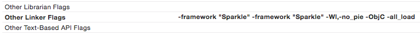
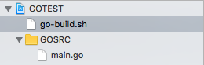
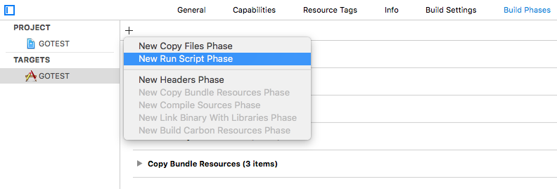
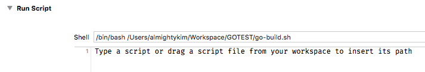

# Xcode + Golang Integration tips/logs

## Stripping

In `Archive` process, Xcode strips symbols (debug, global, and etc...). This causes an issue with Go static library that it would create bug. Go static library should be stripped with Go linker options (`-s -w`), not by `strip`.

Since Cocoa heler and Go Static lib is combined in a subproject, we should have careful stripping policy that static lib project should keep all its symbols for final application target to build executable, and final build target should apply appropriate strip policy to catch crash and prevent reverse engineering.

<sup>*</sup> We'll incorporate Hockeyapp [stripping policy](How_to_solve symbolication_problems.pdf).

- - -

To get filenames, class names and line numbers in the crash reports, you need to make sure the build settings are setup properly depending on the build target type.

1. For **static libraries** the build settings contain the following:

  ```
  Strip Debug Symbols During Copy: No
  Strip Style: Debugging Symbols
  Strip Linked Product: No <- (CRITICAL*)
  ```

2. For **application targets** or OS X **frameworks**, the build settings should contain the following for the release (App Store) build configuration:

  ```
  Strip Debug Symbols During Copy: Yes
  Strip Style: All Symbols
  Strip Linked Product: Yes
  ```

- - -

More Symbol strip policies from [Symbol stripping tips + handy script](Symbol stripping tips + handy script.pdf). Also, read SymbolVisibility of [CppRuntimeEnv](/developer.apple.com/library/content/documentation/DeveloperTools/Conceptual/CppRuntimeEnv/index.html)

<sup>*</sup>This should be tentatively & accordingly applied to final application target.

Recommended Xcode build settings

| Setting | Value |
|---|---|
| Dead Code Stripping                  | YES                              |
| Only Link In Essential Symbols       | NO                               |
| Deployment Postprocessing            | YES (this activates this script) |
| Strip Linked Product                 | NO                               |
| Use Separate Strip                   | NO                               |
| Strip Style                          | All Symbols                      |
| Strip Debug Symbols During Copy      | NO                               |
| Preserve Private External Symbols    | NO                               |
| Separate PCH Symbols                 | YES                              |
| Symbols Hidden By Default            | YES (Critical!)                  |
| Inline Functions Hidden              | YES                              |

## Linker



- No PIE (Position Independent Executable) Linker error

  > ld: warning: PIE disabled. Absolute addressing (perhaps -mdynamic-no-pic) not allowed in code signed PIE, but used in runtime.rodata fromlibstatic-core.a(go.o). To fix this warning, don't compile with -mdynamic-no-pic or link with -Wl,-no_pie

  We'll provide `-Wl,-no_pie` flag in linker to pass for now (03/20/2017)

- Unable to find responder error

  This happens when you're to load static library that has categories, which is not fully loaded.  
  In order to prevent this to happen, apply `-ObjC` and `-all_load` flags to linker

  - `-ObjC` <https://developer.apple.com/library/content/qa/qa1490/_index.html>

    > This flag causes the linker to load every object file in the library that defines an Objective-C class or category. While this option will typically result in a larger executable (due to additional object code loaded into the application), it will allow the successful creation of effective Objective-C static libraries that contain categories on existing classes.  

  - `-all_load` <http://stackoverflow.com/questions/2906147/what-does-the-all-load-linker-flag-do>

    > IMPORTANT: For 64-bit and iPhone OS applications, there is a linker bug that prevents -ObjC from loading objects files from static libraries that contain only categories and no classes. The workaround is to use the -all_load or -force_load flags. -all_load forces the linker to load all object files from every archive it sees, even those without Objective-C code. -force_load is available in Xcode 3.2 and later. It allows finer grain control of archive loading. Each -force_load option must be followed by a path to an archive, and every object file in that archive will be loaded.

## Static Library Project Integration in Workspace


- Drag a static lib proj into workspace
- Add the resultant lib from the project into `linked binary` section of build phase
- Specify header search in user header
  - Don't forget to exclude unnecessary path
  - Make the search recursive if necessary

**Need to build/copy extra static library before compiling the final binary**

For Go static library building, take a look [Go-Static](Go-Static.md).

1. Add a new script file in XCode.  

  
2. Setup a new `Run Script` phase in `Build Phases`  

  
3. Drag the script into `Run Script` phase.  

  
4. Edit the script for what it should do.

  ```sh
  #!/bin/bash
  
  # Exit if any command fails
  set -e
    
  # Environmental variables
  GO_BUILD="${PROJECT_DIR}/../../../PC-APP-V2/.build/"
  
  echo "Project directory : ${PROJECT_DIR}"
  echo "Project source : ${SRCROOT}"
  echo "Go binary destination : ${GO_BUILD}"
  
  # Copy header to goheader
  if [[ -f "${PROJECT_DIR}/../../goheader/pc-core.h" ]]; then
      rm "${PROJECT_DIR}/../../goheader/pc-core.h"
  fi
  cp "${GO_BUILD}/pc-core.h" "${PROJECT_DIR}/../../goheader/"
  
  # Copy PC-CORE binary
  if [[ -f "${PROJECT_DIR}/static-core/pc-core.a" ]]; then
      rm "${PROJECT_DIR}/static-core/pc-core.a"
  fi
  cp "${GO_BUILD}/pc-core.a" "${PROJECT_DIR}/static-core/"
  
  echo "GO PC-CORE copied!"
  ```
  
  Here's link for all the XCode environmental variables.
  - [Xcode Build Settings Reference](https://pewpewthespells.com/blog/buildsettings.html)
  - [How do I print a list of “Build Settings” in Xcode project?](http://stackoverflow.com/questions/6910901/how-do-i-print-a-list-of-build-settings-in-xcode-project)
