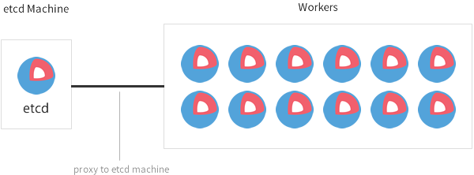

# PocketCluster ETCD Setup

## Overview

ETCD plays the central role in PocketCluster setup in which it provides cluster-wise K/V storage. In particular, there is only one single instance of ETCD service residing on PocketCluster Master (pc-master) host that it's configuration is vital to the entire cluster health. 

Later, we'll look into providing High-Availability or pseudo-production setup.


## ETCD 2.2.8 / 3.1.1 setup on OSX

- All slave knows pc-master address stated in `/etc/hosts`
- Below is deployed in live
- [PC-MASTER SSL CONF](pc-master-cert/pc-master.conf)
  
  Insecure peer conn/ Secure client conn. Listen to local only for peer.<br/>
  heartbeat & election-timeout tuned to 5s and 50s respectively.<br/>
  This is due to the fact that the default swarm heartbeat is [60s](https://github.com/docker/swarm/pull/1501) 
  
  ```sh
  bin/etcd \
  --name="pc-master" \
  --data-dir="../data" \
  --initial-cluster="pc-master=http://127.0.0.1:2380" \
  --initial-advertise-peer-urls="http://127.0.0.1:2380" \
  --listen-peer-urls="http://127.0.0.1:2380" \
  --advertise-client-urls="https://pc-master:2379" \
  --listen-client-urls="https://0.0.0.0:2379" \
  --cert-file="pc-master.cert" \
  --key-file="pc-master.key" \
  --trusted-ca-file="ca-cert.pub" \
  --client-cert-auth=true \
  --heartbeat-interval=50000 \
  --election-timeout=50000 \
  --debug
  ```
  
  `[NOT WORKING]` Secure connection config. Listen to local only for peer with TLS
  
  ```sh
  bin/etcd \
  --name="pc-master" \
  --data-dir="../data" \
  --initial-cluster="pc-master=https://127.0.0.1:2380" \
  --initial-advertise-peer-urls="https://127.0.0.1:2380" \
  --listen-peer-urls="https://127.0.0.1:2380" \
  --peer-cert-file="pc-master.cert" \
  --peer-key-file="pc-master.key" \
  --peer-trusted-ca-file="ca-cert.pub" \
  --peer-client-cert-auth=true \
  --advertise-client-urls="https://pc-master:2379" \
  --listen-client-urls="https://0.0.0.0:2379" \
  --cert-file="pc-master.cert" \
  --key-file="pc-master.key" \
  --trusted-ca-file="ca-cert.pub" \
  --client-cert-auth=true 
  ```
    
  `[NOT WORKING]` Insecure connection
  
  ```sh
  bin/etcd \
  --name="pc-master" \
  --data-dir="../data" \
  --initial-cluster="pc-master=http://192.168.1.105:2380" \
  --initial-advertise-peer-urls="http://pc-master:2380" \
  --advertise-client-urls="http://pc-master:2379" \
  --listen-client-urls="http://0.0.0.0:2379" \
  --listen-peer-urls="http://0.0.0.0:2380" \
  --cert-file="pc-master.cert" \
  --key-file="pc-master.key" \
  --trusted-ca-file="ca-cert.pub" \
  --client-cert-auth=true
  ```
  
- `[WORKING]` Insecure 1:1 translation between [etcd.conf](etcd.conf) and cli argument.

  ```sh
  ETCD_NAME="pc-master"
  ETCD_INITIAL_CLUSTER="pc-master=http://192.168.1.105:2380"
  ETCD_INITIAL_ADVERTISE_PEER_URLS="http://192.168.1.105:2380"
  ETCD_ADVERTISE_CLIENT_URLS="http://192.168.1.105:2379"
  ETCD_LISTEN_CLIENT_URLS="http://0.0.0.0:2379"
  ETCD_LISTEN_PEER_URLS="http://0.0.0.0:2380"
  ETCD_CERT_FILE="/Users/almightykim/Workspace/DKIMG/PC-MASTER/pc-master.cert"
  ETCD_KEY_FILE="/Users/almightykim/Workspace/DKIMG/PC-MASTER/pc-master.key"
  ETCD_TRUSTED_CA_FILE="/Users/almightykim/Workspace/DKIMG/CERT/ca-cert.pub"
  ETCD_CLIENT_CERT_AUTH=true
  ```
 
  ```sh
  bin/etcd \
  --name="pc-master" \
  --data-dir="/Users/almightykim/Workspace/DKIMG/ETCD/data" \
  --initial-cluster="pc-master=http://192.168.1.105:2380" \
  --initial-advertise-peer-urls="http://192.168.1.105:2380" \
  --advertise-client-urls="http://192.168.1.105:2379" \
  --listen-client-urls="http://0.0.0.0:2379" \
  --listen-peer-urls="http://0.0.0.0:2380" \
  --cert-file="pc-master.cert" \
  --key-file="pc-master.key" \
  --trusted-ca-file="ca-cert.pub" \
  --client-cert-auth=true
  ```

> Reference

- <https://github.com/coreos/etcd/blob/v3.1.1/Documentation/op-guide/configuration.md>

## ETCD 2.2.5 setup on vagrant

Following shows an example ETCD setup where `pc-core` is a master host with ip address of `192.168.1.150` and related certs at `/etc/etcd/`

```sh
ETCD_NAME="pc-core"
ETCD_INITIAL_CLUSTER="pc-core=http://192.168.1.150:2380"
ETCD_INITIAL_ADVERTISE_PEER_URLS="http://192.168.1.150:2380"
ETCD_ADVERTISE_CLIENT_URLS="http://192.168.1.150:2379"
ETCD_LISTEN_CLIENT_URLS="http://0.0.0.0:2379"
ETCD_LISTEN_PEER_URLS="http://0.0.0.0:2380"

ETCD_CERT_FILE="/etc/etcd/etcd.cert"
ETCD_KEY_FILE="/etc/etcd/etcd.key"
ETCD_TRUSTED_CA_FILE="/etc/etcd/ca-cert.pub"
ETCD_CLIENT_CERT_AUTH=true
...
```

Few remarks

- We do not need worker proxies  
- Only single instance of ETCD is necessary  
- ETCD works on `peer-to-peer` and `master-client` connection.  
  * We're on `master-client` and `p2p` would later be handled if HA is to be provided.  
- ETCD can be played with [cfssl](https://github.com/cloudflare/cfssl). See [this hack](hack/tls-setup/README.md)
- See more in [sample etcd config](etcd) and [yaml config](sample.etcd.conf.yml)
- ETCD has [disaster recovery feature](https://coreos.com/etcd/docs/latest/etcd-live-cluster-reconfiguration.html#etcd-disaster-recovery-on-coreos-container-linux) 

<sup>*</sup>The following reference comes from [CoreOS Container Linux cluster architectures](https://coreos.com/os/docs/latest/cluster-architectures.html)

## Easy development/testing cluster


<div class="caption">Container Linux cluster optimized for development and testing</div>

| Cost | Great For | Set Up Time | Production |
|------|-----------|-------------|------------|
| Low | Development/Testing | Minutes | No |

When you're first getting started with Container Linux, it's common to frequently tweak your cloud-config which requires booting/rebooting/destroying many machines. Instead of being slowed down and distracted by generating new discovery URLs and bootstrapping etcd, it's easier to start a single etcd node.

You are now free to boot as many machines as you'd like as test workers that read from the etcd node. All the features of fleet, Locksmith, and etcdctl will continue to work properly, but will connect to the etcd node instead of using a local etcd instance. Since etcd isn't running on all of the machines, you'll gain a little bit of extra CPU and RAM to play with.

This environment is now set up to take a beating. Pull the plug on a machine and watch fleet reschedule the units, max out the CPU, etc.

### Configuration for etcd role

Since we're only using a single etcd node, there is no need to include a discovery token. There isn't any high availability for etcd in this configuration, but that's assumed to be OK for development and testing. Boot this machine first so you can configure the rest with its IP address, which is specified with the network unit.

The network unit is typically used for bare metal installations that require static networking. If you're using a cloud-provider, you can omit the network unit and use DHCP and the `$private_ipv4` and `$public_ipv4` variables on platforms that support this. Check the documentation for your specific provider for examples.

Here's the cloud-config for the etcd machine:

```cloud-config
#cloud-config

coreos:
  etcd2:
    name: etcdserver
    initial-cluster: etcdserver=http://10.0.0.101:2380
    initial-advertise-peer-urls: http://10.0.0.101:2380
    advertise-client-urls: http://10.0.0.101:2379
    # listen on both the official ports and the legacy ports
    # legacy ports can be omitted if your application doesn't depend on them
    listen-client-urls: http://0.0.0.0:2379,http://0.0.0.0:4001
    listen-peer-urls: http://0.0.0.0:2380
  units:
    - name: etcd2.service
      command: start
    - name: 00-eth0.network
      runtime: true
      content: |
        [Match]
        Name=eth0

        [Network]
        DNS=1.2.3.4
        Address=10.0.0.101/24
        Gateway=10.0.0.1
```

### Configuration for worker role

This architecture allows you to boot any number of workers, as few as 1 or up to a large cluster for load testing. The notable configuration difference for this role is specifying that fleet should use our etcd proxy instead of starting etcd server locally.

Look how simple the cloud-config becomes:

```cloud-config
#cloud-config

coreos:
  etcd2:
    proxy: on
    listen-client-urls: http://localhost:2379
    initial-cluster: etcdserver=http://10.0.0.101:2380
  fleet:
    etcd_servers: "http://localhost:2379"
  units:
    - name: etcd2.service
      command: start
    - name: fleet.service
      command: start
```