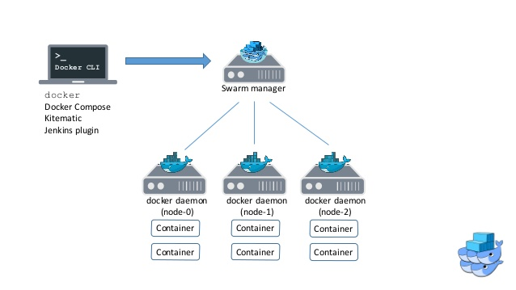

# Swarm + Compose Clustering  
-

### 08/24/2016

**How to setup a swarm cluster without TLS certificate (for debug purpose)**

Setting up a bare minimum Swarm cluster requires neither a key-value storage nor a discovery service. It can be done with Swarm token only. In the future, this might change.

In this case, we'll set a swarm cluster in which a Swarm manager (master) is setup on OSX/Linux with/without Docker daemon and all other Docker daemons connect to the Swarm manager. Then a Docker client connects to the Swarm manager to control the cluster.



```sh
# SWARM MASTER
swarm --debug manage token://<TOKEN> --host=:3376 --advertise=<master_ip>:3376 

# SWARM SLAVE
swarm --debug join --addr=<slave_ip>:2375 token://<TOKEN>

# SWARM CLIENT
docker --host=<master_ip>:3376 version
```

> Example 

```sh
# MANAGER
swarm --debug manage token://1810ffdf37ad898423ada7262f7baf80 --host=:3376 --advertise=192.168.1.236:3376 

# SLAVE
swarm --debug join --addr=192.168.1.140:2375 token://1810ffdf37ad898423ada7262f7baf80

# CLIENT
docker --host=192.168.1.236:3376 version
```

- __Swarm manager does not need reside in the same host where a Docker daemon runs.__  
- Notice that we are not using a Swarm container to connect a Docker daemon to a manager. A Swarm daemon will be setup separately and be able to provide central management with provision + monitoring.  
- Another point of attention is Swarm slaves (agents) does not know which manager to connect. There must be an advertising mechanism we need to be able to control.  

**How to control a Swarm cluster with `docker-compose`**

Once a Swarm cluster is setup, we can control how to setup one with `docker-compose`

```sh
docker-compose -H=<swarm_master_ip>:3376 version
```

With a valid `docker-compose.yml` we can attest if a service is ready to run

```sh
docker-compose -H=<swarm_master_ip>:3376 up -d
```

> Example  

- `docker-compose.yml` with node constraint  

```yml
version: "2"
services:
  foo:
    image: hypriot/whoami
    environment:
      - "constraint:node==pocket"
```

> References for Swarm / Compose

- [Using Compose with Swarm](https://docs.docker.com/compose/swarm/)
- [Get started with multi-host networking](https://docs.docker.com/engine/userguide/networking/get-started-overlay/)
- <https://github.com/flurdy/docker-compose-machine-swarm-cloud-example>
- [Leveraging Multi-CPU Architecture Support](https://docs.docker.com/docker-for-mac/multi-arch/)
- <https://github.com/justincormack/cross-docker>
- [Docker Compose to Orchestrate Containers](http://blog.arungupta.me/docker-compose-orchestrate-containers-techtip77/)
- [Docker Machine, Swarm and Compose for multi-container and multi-host applications](http://blog.arungupta.me/docker-machine-swarm-compose-couchbase-wildfly/)
- [Multi-container Applications using Docker Compose and Swarm](http://blog.arungupta.me/multicontainer-applications-docker-compose-swarm/)
- [Tutorial: Using Flocker with Docker, Swarm, Compose](https://docs.clusterhq.com/en/1.14.0/docker-integration/tutorial-swarm-compose.html)
- [Docker Machine, Compose, and Swarm: How They Work Together](https://blog.codeship.com/docker-machine-compose-and-swarm-how-they-work-together/)
- [Let Docker Swarm all over your Raspberry Pi Cluster](http://blog.hypriot.com/post/let-docker-swarm-all-over-your-raspberry-pi-cluster/)
- [Build a Swarm cluster for production](https://docs.docker.com/swarm/install-manual/)
- [Hypriot Cluster Lab](https://github.com/hypriot/cluster-lab)

> Tools

- <https://github.com/vishnubob/wait-for-it>

**`docker-machine` & `docker-swarm` & `docker-compose`**

- Swarm is the cluster provisioner and controller
- Compose provide ways to provision and control a Swarm cluster. It even lets a clustered container to run in sequence according to dependencies.
- Machine is a provisioner. It simply sets up TLS and connectivity setup within a multiple hosts.

  


  > Examples
  
  ```sh
  docker-machine create -d virtualbox --swarm --swarm-master --swarm-discovery token://&lt;TOKEN&gt; swarm-master
  docker-machine create -d hypriot --swarm --swarm-master --swarm-discovery token://$TOKEN --hypriot-ip-address 192.168.1.101 pi1
  ```
  
  > Setup example we tried on vagrant-virtualbox
  
  ```sh
  # MASTER
  docker-machine create --driver generic --generic-ip-address=192.168.1.140 --generic-ssh-key ~/.ssh/id_rsa.pub --generic-ssh-user "ubuntu" --swarm --swarm-master --swarm-discovery token://1810ffdf37ad898423ada7262f7baf80 --swarm-host "tcp://0.0.0.0:3376" $(hostname) 

  # SLAVE
  docker-machine create --driver generic --generic-ip-address=192.168.1.151 --generic-ssh-key ~/.ssh/id_rsa.pub --generic-ssh-user "pocket" --swarm --swarm-discovery token://1810ffdf37ad898423ada7262f7baf80 pocket
  ```
  
  > `docker-machine` provisioned `config.json`
  
  ```json
  {
      "ConfigVersion": 3,
      "Driver": {
          "IPAddress": "0.0.0.0",
          "MachineName": "ubuntu-xenial",
          "SSHUser": "ubuntu",
          "SSHPort": 22,
          "SSHKeyPath": "/home/ubuntu/.docker/machine/machines/ubuntu-xenial/id_rsa",
          "StorePath": "/home/ubuntu/.docker/machine",
          "SwarmMaster": false,
          "SwarmHost": "",
          "SwarmDiscovery": "",
          "EnginePort": 2375,
          "SSHKey": "/home/ubuntu/.ssh/id_rsa"
      },
      "DriverName": "generic",
      "HostOptions": {
          "Driver": "",
          "Memory": 0,
          "Disk": 0,
          "EngineOptions": {
              "ArbitraryFlags": [],
              "Dns": null,
              "GraphDir": "",
              "Env": [],
              "Ipv6": false,
              "InsecureRegistry": [],
              "Labels": [],
              "LogLevel": "",
              "StorageDriver": "",
              "SelinuxEnabled": false,
              "TlsVerify": true,
              "RegistryMirror": [],
              "InstallURL": "https://get.docker.com"
          },
          "SwarmOptions": {
              "IsSwarm": true,
              "Address": "",
              "Discovery": "token://1810ffdf37ad898423ada7262f7baf80",
              "Master": true,
              "Host": "tcp://0.0.0.0:3376",
              "Image": "swarm:latest",
              "Strategy": "spread",
              "Heartbeat": 0,
              "Overcommit": 0,
              "ArbitraryFlags": [],
              "Env": null,
              "IsExperimental": false
          },
          "AuthOptions": {
              "CertDir": "/home/ubuntu/.docker/machine/certs",
              "CaCertPath": "/home/ubuntu/.docker/machine/certs/ca.pem",
              "CaPrivateKeyPath": "/home/ubuntu/.docker/machine/certs/ca-key.pem",
              "CaCertRemotePath": "",
              "ServerCertPath": "/home/ubuntu/.docker/machine/machines/ubuntu-xenial/server.pem",
              "ServerKeyPath": "/home/ubuntu/.docker/machine/machines/ubuntu-xenial/server-key.pem",
              "ClientKeyPath": "/home/ubuntu/.docker/machine/certs/key.pem",
              "ServerCertRemotePath": "",
              "ServerKeyRemotePath": "",
              "ClientCertPath": "/home/ubuntu/.docker/machine/certs/cert.pem",
              "ServerCertSANs": [],
              "StorePath": "/home/ubuntu/.docker/machine/machines/ubuntu-xenial"
          }
      },
      "Name": "ubuntu-xenial"
  }  
  ```
  
  > Swarm manage options

  ```sh
  Usage: swarm manage [OPTIONS] <discovery>
  
  Manage a docker cluster
  
  Arguments:
     <discovery>    discovery service to use [$SWARM_DISCOVERY]
                     * token://<token>
                     * consul://<ip>/<path>
                     * etcd://<ip1>,<ip2>/<path>
                     * file://path/to/file
                     * zk://<ip1>,<ip2>/<path>
                     * [nodes://]<ip1>,<ip2>
  
  Options:
     --strategy "spread"                                  placement strategy to use [spread, binpack, random]
     --filter, -f [--filter option --filter option]       filter to use [health, port, containerslots, dependency, affinity, constraint]
     --host, -H [--host option --host option]             ip/socket to listen on [$SWARM_HOST]
     --replication                                        Enable Swarm manager replication
     --replication-ttl "20s"                              Leader lock release time on failure
     --advertise, --addr                                  Address of the swarm manager joining the cluster. Other swarm manager(s) MUST be able to reach the swarm manager at this address. [$SWARM_ADVERTISE]
     --tls                                                use TLS; implied by --tlsverify=true
     --tlscacert                                          trust only remotes providing a certificate signed by the CA given here
     --tlscert                                            path to TLS certificate file
     --tlskey                                             path to TLS key file
     --tlsverify                                          use TLS and verify the remote
     --engine-refresh-min-interval "30s"                  set engine refresh minimum interval
     --engine-refresh-max-interval "60s"                  set engine refresh maximum interval
     --engine-failure-retry "3"                           set engine failure retry count
     --engine-refresh-retry "3"                           deprecated; replaced by --engine-failure-retry
     --heartbeat "60s"                                    period between each heartbeat
     --api-enable-cors, --cors                            enable CORS headers in the remote API
     --cluster-driver, -c "swarm"                         cluster driver to use [swarm, mesos-experimental]
     --discovery-opt [--discovery-opt option --discovery-opt option]  discovery options
     --cluster-opt [--cluster-opt option --cluster-opt option]        cluster driver options
                                                           * swarm.overcommit=0.05            overcommit to apply on resources
                                                           * swarm.createretry=0              container create retry count after initial failure
                                                           * mesos.address=                   address to bind on [$SWARM_MESOS_ADDRESS]
                                                           * mesos.checkpointfailover=false   checkpointing allows a restarted slave to reconnect with old executors and recover status updates, at the cost of disk I/O [  $SWARM_MESOS_CHECKPOINT_FAILOVER]
                                                           * mesos.port=                      port to bind on [$SWARM_MESOS_PORT]
                                                           * mesos.offertimeout=30s           timeout for offers [$SWARM_MESOS_OFFER_TIMEOUT]
                                                           * mesos.offerrefusetimeout=5s      seconds to consider unused resources refused [$SWARM_MESOS_OFFER_REFUSE_TIMEOUT]
                                                           * mesos.tasktimeout=5s             timeout for task creation [$SWARM_MESOS_TASK_TIMEOUT]
                                                           * mesos.user=                      framework user [$SWARM_MESOS_USER]    
  ```

  > Swarm With TLS example
  
  ```sh
  swarm -debug manage token://1810ffdf37ad898423ada7262f7baf80 --host=0.0.0.0:3376 --tls --tlscacert=/home/ubuntu/.docker/machine/certs/ca.pem --tlscert=/home/ubuntu/.docker/machine/machines/ubuntu-xenial/server.pem --tlskey=/home/ubuntu/.docker/machine/machines/ubuntu-xenial/server-key.pem
  ```

- `docker-machine` breaks docker service with following in `/etc/systemd/system/docker.service`.

  ```sh
  [Service]
  # TLS enabled daemon
  # ExecStart=/usr/bin/docker daemon -H tcp://0.0.0.0:2375 -H unix:///var/run/docker.sock --insecure-registry 192.168.1.100:5000 --tlsverify --tlscacert /etc/docker/ca.pem --tlscert /etc/docker/server.pem --tlskey /etc/docker/server-key.pem --  label provider=generic
  ExecStart=/usr/bin/docker daemon -H tcp://0.0.0.0:2375 -H unix:///var/run/docker.sock --insecure-registry 192.168.1.100:5000 --label provider=generic
  MountFlags=slave
  LimitNOFILE=1048576
  LimitNPROC=1048576
  LimitCORE=infinity
  Environment=
  
  [Install]
  WantedBy=multi-user.target
  ```  
  * Watch out for stroage driver config. `docker-machine` changes it to default `aufs`.

> Reference for docker machine

- [Docker Machine Overview](https://docs.docker.com/machine/overview/)
- <https://github.com/docker/machine>
- [Generic Driver](https://docs.docker.com/machine/drivers/generic/)
- [Configuring and running Docker on various distributions](https://docs.docker.com/engine/admin/)
- [Control and configure Docker with systemd](https://docs.docker.com/engine/admin/systemd/)
- [docker-machine installs broken systemd unit file during provisioning](https://github.com/docker/machine/issues/2795)