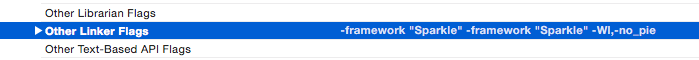
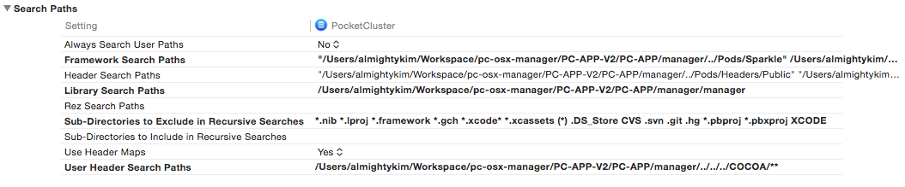

# Xcode + Golang Integration tips/logs

## Linker

- No PIE (Position Independent Executable) Linker error

  > ld: warning: PIE disabled. Absolute addressing (perhaps -mdynamic-no-pic) not allowed in code signed PIE, but used in runtime.rodata fromlibstatic-core.a(go.o). To fix this warning, don't compile with -mdynamic-no-pic or link with -Wl,-no_pie

  We'll provide `-Wl,-no_pie` flag in linker to pass for now (03/20/2017)

- Unable to find responder error

  This happens when you're to load static library that has categories, which is not fully loaded.  
  In order to prevent this to happen, apply `-ObjC` and `-all_load` flags to linker

## Static Library Project Integration in Workspace

- Drag a static lib proj into workspace
- Add the resultant lib from the project into `linked binary` section of build phase
- Specify header search in user header
  - Don't forget to exclude unnecessary path
  - Make the search recursive if necessary
