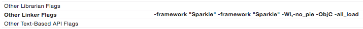

# Xcode + Golang Integration tips/logs

- No PIE (Position Independent Executable) Linker error

  > ld: warning: PIE disabled. Absolute addressing (perhaps -mdynamic-no-pic) not allowed in code signed PIE, but used in runtime.rodata fromlibstatic-core.a(go.o). To fix this warning, don't compile with -mdynamic-no-pic or link with -Wl,-no_pie

  We'll provide `-Wl,-no_pie` flag in linker to pass for now (03/20/2017)
  
